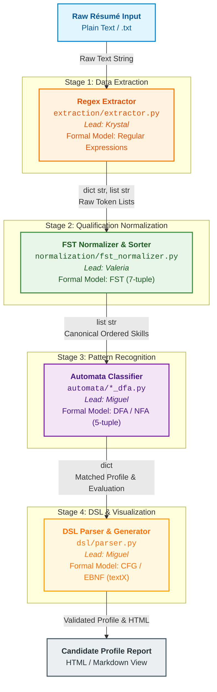

# ResumeLens — System Architecture & Module Design

## 1. System Overview
ResumeLens is an automated résumé-screening application built on a 4-stage processing pipeline grounded in formal language theory and automata theory. The system extracts relevant candidate qualifications from raw text résumés, normalizes varied naming conventions into canonical terms, evaluates qualification patterns against formal profile specifications, and validates the structured output using a Domain-Specific Language (DSL) for visualization.

---

## 2. Pipeline Architecture Diagram

## 3. Detailed Module Specifications

### Module 1: Information Extraction (`extraction/`)
* **Lead:** Krystal
* **Formal Model:** Regular Expressions (Regex)
* **Input:** Raw résumé text (`.txt` or plain string).
* **Output:** A dictionary containing lists of extracted raw tokens (contact info, programming languages, frameworks/libraries, databases, academic history, professional experience).
* **Key Responsibility:** Identify and capture textual patterns that correspond to candidate qualifications without performing normalization or determining profile compliance.

### Module 2: Qualification Normalization & Sorting (`normalization/`)
* **Lead:** Valeria
* **Formal Model:** Finite-State Transducers (FSTs, 7-tuple \\(M = (Q, \Sigma, \Gamma, \delta, \omega, q_0, F)\\))
* **Input:** Dictionary of raw extracted token lists from Module 1.
* **Output:** Standardized canonical skill sequence ordered according to the target professional profile (e.g., Frontend → Backend → Database → Tools).
* **Key Responsibility:** Map naming variations, abbreviations, and spelling differences (e.g., `"JS"`, `"JavaScript"`, `"js"` → `"JAVASCRIPT"`) into standard canonical tokens using `pyformlang.fst.FST`, and sort them to eliminate order-dependency during classification.

### Module 3: Pattern Recognition & Classification (`automata/`)
* **Lead:** Miguel
* **Formal Model:** Deterministic Finite Automata (DFA) / Nondeterministic Finite Automata (NFA / \\(\varepsilon\\)-NFA, 5-tuple \\(M = (Q, \Sigma, \delta, q_0, F)\\))
* **Input:** Canonical, ordered skill sequence from Module 2.
* **Output:** Classification result (`MACHINE_LEARNING_ENGINEER`, `FULL_STACK_DEVELOPER`, `DEVOPS_ENGINEER`, `NLP_ENGINEER`) and evaluation status (`ACCEPTED` or `REJECTED`).
* **Key Responsibility:** Process the normalized qualification string to verify if it satisfies the required formal qualification sequence for a specific professional role.

### Module 4: DSL Specification & Visualization (`dsl/` & `visualization/`)
* **Lead:** Miguel
* **Formal Model:** Context-Free Grammars (CFG) / EBNF implemented with `textX`
* **Input:** Candidate metadata, normalized qualifications, and classification evaluation status.
* **Output:** Structurally validated candidate profile specification and generated visual HTML/Markdown report.
* **Key Responsibility:** Enforce formal syntactic structure over the generated candidate profile representation and render a clean visualization for recruiters.

---

## 4. Inter-Module Data Contracts

| Pipeline Interface | Source Module | Target Module | Data Structure / Contract Format |
|---|---|---|---|
| **Extraction → Normalization** | `extraction` | `normalization` | `dict[str, list[str]]` containing raw extracted tokens grouped by category (e.g., `{"languages": ["JS", "py"], "databases": ["Postgres"]}`) |
| **Normalization → Classification** | `normalization` | `automata` | `list[str]` containing canonical tokens sorted in profile order (e.g., `["JAVASCRIPT", "REACT", "NODE_JS", "POSTGRESQL", "GIT"]`) |
| **Classification → DSL/UI** | `automata` | `dsl` / `visualization` | `dict` containing candidate info, canonical skills, matched profile name, and result status (`"ACCEPTED"` / `"REJECTED"`) |
